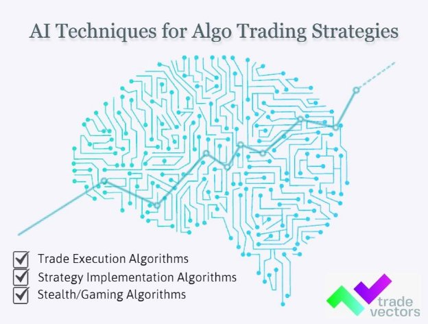

# **How artificial intelligence helps in Algo Trading?**

We are in the year 2022, where technology has overtaken our lives. Every business or domain relies on technology that has brought down human interference. Trading is not everyone's cup of tea, and it needs strategy insight into the trading market and other aspects. 

Trading is the process of making judgments concerning asset transfers to profit. All technical analysis is based on statistical data, market behavior in the past, and market reactions. As a result, not only can a person analyze and search for market trends, but a computer and artificial intelligence can.

Trading robots have long been used in the stock market, concentrating on price movements in trends and inside channels. According to a JPMorgan study from 2020, over 60% of trades worth more than $10 million were executed using algorithms. By 2024, the algorithmic trading market will have grown by $4 billion, bringing the total volume to $19 billion.

Since AI, machine learning, and data science are radically transforming the world, we need to look at how they affect finance and [Algo trading strategies](https://tradevectors.com/algo-trading-strategies.php), especially now when markets are so fragile and volatile.
## **Artificial Intelligence for Algo Trading**
Since they manipulate data and estimate the future market picture with great precision, AI-based algorithms are instrumental in optimizing people's decision-making processes. Traders can take timely moves and optimize their gains based on these projections. We all know that human emotions may impact trading, a significant roadblock to achieving peak performance. Algorithms and computer programmes make choices faster than people without regard for extraneous considerations like emotions. [Algo trading](https://tradevectors.com/) isn’t new, and they have been in the picture since the 80s, but lately, there has been a full-fledged use of AI for Algo trading.

There are different examples of **Algo Trading strategies used in Artificial Intelligence** -

`      `

***Trade Execution Algorithms:*** They divide the trade into smaller orders to reduce the impact on the stock price. Trade execution is a common practice.

***Strategy Implementation Algorithms:*** They place trades based on indications generated by real-time market data.

***Stealth/Gaming Algorithms:*** Price changes are caused by large transactions or other algorithmic tactics exploited by stealth or gaming algorithms.
### **Use of AI in Algorithmic Trading**
***High-Frequency Trading***

High-Frequency Trading (HFT) is a [type of algorithmic trading](https://medium.com/@tradevectors/what-are-the-different-types-of-algorithms-that-can-be-used-for-automated-trading-303aa38b907) in which a huge order is executed in a fraction of a second. Humans are incapable of carrying out many commands in such a short period. Traders use algorithms and computers to automate orders because reading the market trend and placing bids manually takes a long time.

***Helps in Finding Data Patterns***

One of the most important goals for Artificial Learning is to use a large amount of previous data to forecast the future correctly. Traders frequently notice time and space-constrained localized trends and consider manipulating them for a higher return. Artificial Intelligence algorithms aid in discovering patterns that may be used in conjunction with traders' intuition and expertise to make appropriate judgments.

***Use of Chatbots***

Chatbots converse with traders and provide them with a history of financial statements and other relevant data. Chatbots give the brokers helpful information, including real-time quotes, account statements, FAQs (Frequently Asked Questions), and price alerts. When Artificial Intelligence systems drive these chatbots, they outperform humans.

\===

**Author: Ankur Parikh**

Ankur Parikh is a Co-Founder of Trade Vectors LLP. Completed his Masters in Computer Science from University of Massachusetts Lowell, US. More than 9 years of experience as a software programmer and algo trader. Experience with many trading platforms API, manual trading, automated trading, managing investor's portfolio.

**About Trade Vectors LLP**

Trade Vectors is a young venture, located in INDIA and CANADA. Trade Vectors has been into algo trading consultancy since 2013. Which helps you to set up your automated trading software system for stocks, forex, futures, options, etc. Trade Vectors offer their own in-house algo trading strategies with the best returns. 

\*SHORT BIO OF TRADE VECTOR ARTICLE:

Algo Trading Software is usually based on technologies like machine learning and data science. AI-Based algorithms are instrumental in optimizing people's decision making processes. All technical analysis is based on past statistical data. So as a result, not only can a person analyze and search for market trends, but a computer and artificial intelligence also can. So we need to look at how they affect Finance and Algo Trading Strategies. (442 Character)

