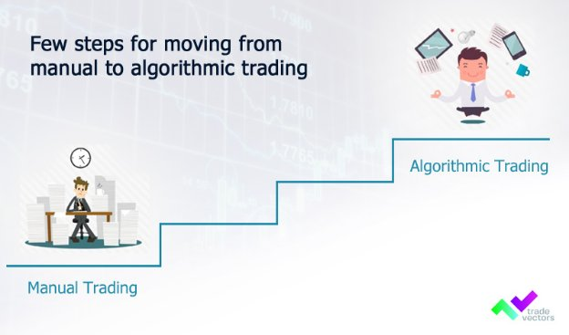

# **How to move from manual trading to Algorithmic trading?**

We live in the twenty-first century, which is delicately active and changing by the minute. Humanity's manual activities have been taken over by Artificial Intelligence. This has a lot to do with modern-day trade changes. The so-called [Algorithmic trading](https://medium.com/@tradevectors/what-is-algorithmic-trading-or-algo-trading-7ac0949ea6d7) has supplanted manual trading. The rising discussion on Algo vs. manual trading is due to the increased use of Algo trading, often known as automated trading systems.

There are a plethora of Forex trading robots available, and virtually all promise to be able to transform modest accounts into large sums of money overnight.
### **Advantages of Algo Trading**
- Making a robot trade on your behalf is simply the essence of it. It is precise, meticulously disciplined, and error-free.
- One of the most difficult challenges that traders confront is the ability to remain patient and stick to a strategy. You may rest certain that the robot will be well-behaved and follow the [trading strategy](https://tradevectors.com/algo-trading-strategies.php) you devised using automated trading, also known as algorithmic trading. A profitable trader distinguishes himself from an unprofitable trader by his commitment to stick to his approach.
- Not only can a robot trade with higher discipline, execution, and range, but it also does not get fatigued. The trading robot will remain at the markets 24 hours a day, while you choose the few hours that are most convenient for you. That's three, four, or even ten times the amount traded on the market by a manual trader.
- When trading is automated, choices about when to enter and leave positions are determined in advance of the activities being performed. This eliminates the tension, and greed that might distort your judgment when [making real-time trading](https://tradevectors.com/) judgments.
## **Steps to shift from Manual Trading to Algorithm Trading**
- **Understanding the New Paradigm**

You must cease thinking about trading as a series of decisions and actions that you take to enter and exit positions. Instead, consider trading to be a two-step process: strategy creation and plan implementation. You'll develop your strategies based on your expertise and experience, and your algorithm will handle the execution - the actual act of trading.

Your new work will include pressing your brain to get into the intense trading thinking zone. It'll be about extracting your trading knowledge and using it to create, tuning, and polishing the strategies needed for the algorithm trading.

- **Structuring your Trading System**

You'll need to follow some form of framework to arrange the collection of rules you'll input your algorithm. This is true for any sort of automation.

It is quite simple to automate a highly particular process with a well-defined structure. Automating an unknown or undefined process, on the other hand, may be rather difficult.

- **Choosing the right Algo Trading Platform**

Choosing a trading automation platform is quite a confusing, but also personal decision, since the programme must meet your unique requirements, which are unlikely to be shared by others. Are you a techie or does your seven-year-old know how to use your phone better than you?

Can you handle a difficult software installation? Are you able to handle your own execution environment?

Would you rather employ a platform-as-a-service option, which would almost definitely include entrusting your exchange API keys and/or cash to a third party?

- **Use of ML/AI**

Algorithm trading involves use of machine learning and artificial intelligence that makes less use of human interference. When it comes to human interference, human emotions also involves that can bring loss in the trading. If you have good insight of using ML/AI for Algo trading, then it is better to shift soon. The ultimate aim is to have an automated trading process.

**Conclusion**

Considering the above aspects can help you to shift from manual trading to Algo trading, and also enjoy benefits of the same. 

**Short Summary:** 

We live in the twenty-first century, which is delicately active and changing by the minute. Humanity's manual activities have been taken over by Artificial Intelligence. This has a lot to do with modern-day trade changes. Let’s learn the advantages of using Algorithmic trading and know steps to transform your manual trading to automated trading systems. 

**Author: Ankur Parikh**

Ankur Parikh is a Co-Founder of Trade Vectors LLP. Completed his Masters in Computer Science from University of Massachusetts Lowell, US. More than 9 years of experience as a software programmer and algo trader. Experience with many trading platforms API, manual trading, automated trading, managing investor's portfolio.

**About Trade Vectors LLP**

Trade Vectors is a young venture, located in INDIA and CANADA. Trade Vectors has been into algo trading consultancy since 2013. Which helps you to set up your automated trading software system for stocks, forex, futures, options, etc. Trade Vectors offer their own in-house algo trading strategies with the best returns. 

